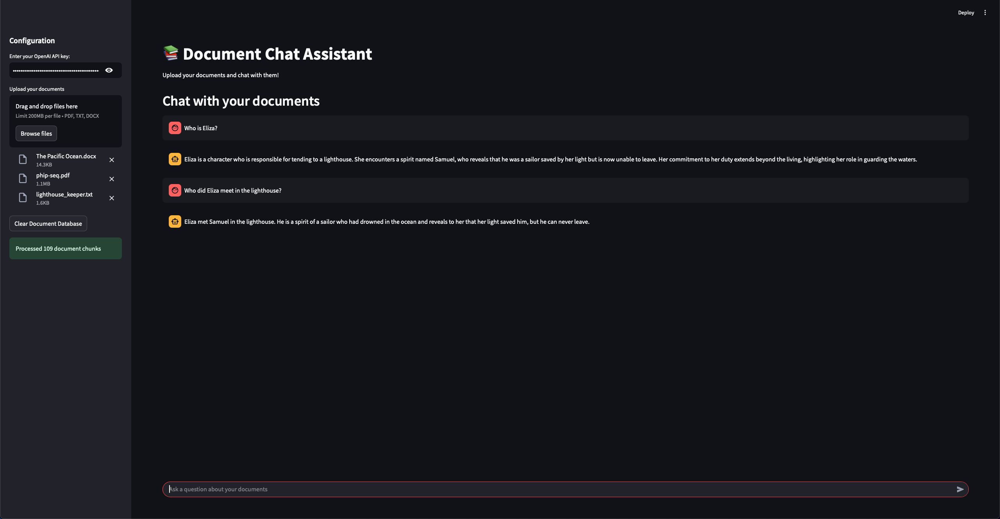

# Document-Chatbot-RAG

## Overview
Document-Chatbot-RAG is a Streamlit-based application that allows users to upload documents and interact with them through a chatbot interface. The application leverages retrieval-augmented generation (RAG) to provide accurate and relevant answers based on the uploaded documents.

## Features
- Upload multiple documents (PDF, TXT, DOCX)
- Retrieve answers based on document contents
- Chat with an AI assistant that processes document-based queries
- Clear document database functionality
- Secure API key entry

## Installation
To run the application, first install the required dependencies:

```sh
pip install -r requirements.txt
```

## Usage
Run the Streamlit app with the following command:

```sh
streamlit run app.py
```

### Uploading Documents
1. Launch the application.
2. Enter your OpenAI API key.
3. Upload documents in supported formats.
4. Start chatting with the AI assistant.

## File Structure
```
.
├── app.py            # Main Streamlit application
├── graph.py          # Graph-based AI workflow
├── constant.py       # Constants and configurations
├── utils.py          # Utility functions for document processing
├── requirements.txt  # Dependencies
├── README.md         # Documentation (this file)
```

## Dependencies
The application requires the following libraries:

```txt
langchain-core
langchain-openai
langchain
langchain-community
langchain-experimental
langgraph
langchain-chroma==0.2.2
streamlit
docx2txt
pypdf
```

## Placeholder for Image



## Author
- Atharv Verma
- atharv.verma29k@gmail.com


